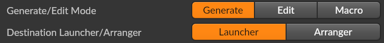
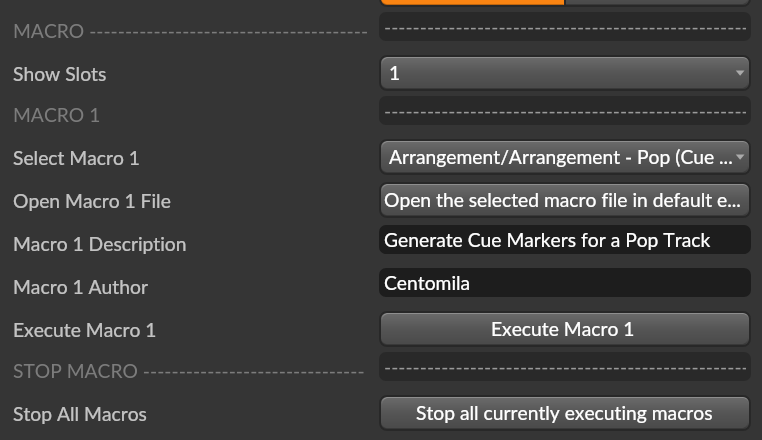

# BitwigBuddy Manual

## 🎹 Introduction

### What is BitwigBuddy?

BitwigBuddy is a comprehensive extension for Bitwig Studio designed to simplify and accelerate your music production workflow. It enables efficient creation, editing, and automation of MIDI patterns, drum sequences, and complex macros. Perfect for streamlining tasks and boosting creativity!

### ⚙️ Installation

Follow these steps to install BitwigBuddy:

1. Download the latest BitwigBuddy extension package from the Release page.
2. Extract the contents.
3. Move the extracted BitwigBuddy folder into the Bitwig extensions folder:
   - **Windows:** `%USERPROFILE%\Documents\Bitwig Studio\Extensions`
   - **Windows with OneDrive:** `%USERPROFILE%\OneDrive\Documents\Bitwig Studio\Extensions`
   - **macOS:** `~/Documents/Bitwig Studio/Extensions`
   - **Linux:** `~/Bitwig Studio/Extensions`
4. In Bitwig, go to **Settings > Controller > Add Extension > Centomila > BitwigBuddy**

## 1️⃣ Generate Mode

### 🎵 Presets

BitwigBuddy comes with numerous predefined rhythmic and melodic presets for quick pattern generation.

#### Preset Mode Panels

- **Generate/Edit/Macro Mode:** Set this to "Generate" to create patterns.
- **Destination:**
  - **Launcher:** Generated pattern is placed in the Clip Launcher view.
  - **Arranger:** Generated pattern is placed on the arranger timeline.
- **Preset/Program:** Set this to "Preset" to select from predefined patterns.
- **Replace/Add Pattern:**
  - **Replace:** Overwrites existing notes completely.
  - **Add:** Adds generated pattern to existing notes.
- **Reverse Pattern:**
  - **Normal:** Plays pattern as saved.
  - **Reverse:** Plays pattern in reverse order.
- **Repeat Pattern X Times:**
  - Repeat the pattern X times (1 to 8 times)
  - Default: 1
  - Example: If a pattern is 16 steps and you set Repeat Pattern to 2, the pattern will be 32 steps long
  - Max 128 steps! If the pattern is longer than 128 steps, it will be truncated

### 🛠️ Creating Customized Presets

Save custom presets as `.txt` files in the `BitwigBuddy/Custom Presets` folder. Presets follow this syntax:

```
# Custom Preset Example
Preset Name: MyCustomPreset
Steps: 80,0,80,0,80,0,80,0
DefaultNote: "C#1"
Note Channel: 1
Step Size: 1/16
Subdivisions: Straight
Note Length: 1/16
```

#### Preset File Settings Explained:
- **Preset Name:** Display name in BitwigBuddy.
- **Steps:** Comma-separated velocities (0-127), 0 = no note.
- **DefaultNote:** Sets default MIDI note and octave (e.g., "C#1").
- **Note Channel:** MIDI channel for generated notes.
- **Step Size:** Rhythmic value of each step.
- **Subdivisions:** Rhythm subdivisions (Straight, Triplets, Quintuplets, Septuplets).
- **Note Length:** Length of each generated note.

#### Tips & Ideas
- Rapidly browse presets for quick inspiration.
- Reverse patterns for creative rhythmic results.
- Save your favorite patterns for easy recall.
- Use the "Learn Note from selected drum pad" feature - select _DM_ from the _Learn Note_ selection and click on a drum pad to set the note destination.

## 🎲 Generate - Program Mode

#### Program Mode Panels
- **Pattern Type:** Select "Program" for semi-random patterns.
- **Steps:** Shows the generated step sequence.
- **Velocity Range:**
  - **Min Velocity:** Minimum note velocity.
  - **Max Velocity:** Maximum note velocity.
- **Velocity Shape:** Distribution method (Random, Linear, Arc, Sine, etc.). Options include:
  - "Random", "Flat (Value by Min Velocity)", "Linear Inc", "Linear Dec"
  - "Ease Out Cubic Inc", "Ease In Cubic Inc", "Ease Out Cubic Dec", "Ease In Cubic Dec"
  - "Ease InOut Inc", "Ease InOut Dec", "Arc", "Sine", "Cosine", "Double Cosine"
  - "Alternate Min Vel and High Vel", "Alternate High and Min Vel"
  - "Saw 2 Inc", "Saw 2 Dec", "Saw 3 Inc", "Saw 3 Dec", "Saw 4 Inc", "Saw 4 Dec"
  - "Triangle", "Square Inc", "Square Dec", "Square 2 Inc", "Square 2 Dec"
  - "Square 3 Inc", "Square 3 Dec", "Square 4 Inc", "Square 4 Dec"
- **Density:** Frequency of notes occurrence (0% to 100%).
- **Step Quantity:** Number of generated steps.
- **Skip Step Every X:** Skip steps systematically:
  - Example: Density 100%, Skip Step Every X at 1 → Skips all odd-numbered steps.
  - Example: Density 100%, Skip Step Every X at 2 → Skips all even steps.
  - Example: Density 100%, Skip Step Every X at 3 → Skips every third step in a pattern.

#### Post Actions
- **Duplicate Clip**: Creates a copy of the generated clip (Clip Launcher only)
- **Launch Clip**: Automatically plays the newly generated clip
- **Switch to Edit View Layout**: Changes Bitwig interface to Edit View after generation
- **Zoom To Fit**: Automatically zooms to show the entire pattern

#### Tips & Ideas
- Adjust density to quickly vary patterns.
- Experiment with velocity shapes to enhance groove.
- Use Skip Step creatively for unique rhythmic variations.
- Save generated patterns as custom presets with the "Save Custom Pattern" button.
- Try using "Add Pattern" with low density settings to create interesting variations.

## ✏️ Edit Mode

#### Edit Panels Explained

- **Update Selected Steps Velocity:** Modify velocity of highlighted notes.
- **Velocity Range:** Set the velocity limits (min/max).
- **Velocity Shape:** Choose distribution shape from the same options as Program Mode.
- **Clear Current Clip/Note Destination:** Clear the selected pattern or MIDI assignment.

#### Tips & Ideas
- Quickly humanize existing MIDI patterns by selecting notes and applying Random velocity shape.
- Create crescendos with Linear Inc velocity shape.
- Create diminuendos with Linear Dec velocity shape.
- Add swing feel by adjusting velocities of off-beat notes.
- Use Edit Mode for detailed pattern refinement.

## ⚡ Macro Mode

### 🎼 What is a Macro?

Macros in BitwigBuddy automate sequences of native Bitwig actions combined with custom commands, streamlining complex or repetitive tasks. Bitwig Actions correspond almost entirely to the list of Bitwig keyboard shortcut commands, including the not mapped ones.

#### Macro Panels

##### Macro 1-4

Macros stored in the `BitwigBuddy/Macros` folder.



- **Show Slots** Change slot view, switch to Instant Macro mode or hybrid mode.
- **Select Macro 1** Choose macro sequences to execute.
- **Open Macro 1 File** Open the selected macro file in the default text editor.
  - You can edit your file and save it to apply changes. No need to restart BitwigBuddy.
- **Macro 1 Description** Display the description of the selected macro.
- **Macro 1 Author** Display the author of the selected macro.
- **Execute Macro 1** Execute the selected macro.
- **Stop All Macros** Stop the execution of all macros.

##### Instant Macro

Define up to 8 quick-execute actions.

- **Instant Macro Field:** Enter custom commands for quick execution
- **Action Buttons 1-8:** Execute corresponding instant macro command
- **Save Instant Macros:** Store your current instant macro setup
- **Load Instant Macros:** Recall previously saved instant macro configurations

#### BitwigBuddy Panel Mode

The BitwigBuddy Panel offers different viewing modes to accommodate your workflow:

- **Standard Mode:** Shows all four macro slots with full information
- **Compact Mode:** Displays reduced information for each slot to save screen space
- **Hybrid Mode:** Combines instant macros with regular macro slots
- **Instant Only:** Shows just the instant macro interface for maximum simplicity

### 📂 Preset Folder

Store macros as `.txt` files in the `BitwigBuddy/Macros` folder. You can also use subfolders for organization.

#### Macro Syntax

Macros are written as commands, each line is an action. Commands include all Bitwig Actions and additional functions specifically made for this mode.

Notes:
- Commands are case-sensitive.
- Many additional commands require parameters in parentheses.
  - Parameters can be "Strings", Int (-1, 0, 1, 2, 3 etc), Float (-2.5, 0.0, 1.2, 420.42 etc), or Boolean (true/false).
- Some actions require the correct Bitwig view to be in focus (For example "Select All" has a different effect in the Arranger and Clip Launcher).
  - To automatically close the BitwigBuddy Panel, launch the command "Full screen". You can also send it two times to go back to the previous window mode.

Every Macro starts with some meta tags that define the name and description of the macro. These are not commands and are used to identify the macro in the list.

```MyMacro.txt
Macro: "Macro Name"
Description: "Macro Description/Instruction/Notes"
Author: "Author Name"
```

#### Variables and Loops

BitwigBuddy macros support variables and loops for more advanced automation:

##### Variables

Variables can be defined and used throughout your macro:

```
var clipLength = 4
var trackName = "Drums"
var basePosition = 2

// Use variables in commands with ${varName}
Clip Create(${basePosition}, ${clipLength})
Track Rename(${trackName})
```

##### For Loops

For loops allow you to repeat commands with an incrementing counter:

```
// Basic for loop syntax
for (i = 1 to 4) {
    Clip Create(${i}, 4)
    Clip Color(#FF0000)
}
```

The loop above will create 4 clips in positions 1, 2, 3, and 4, all with length 4 and colored red.

##### Math Expressions

You can perform calculations within variable references using standard math operators:

```
var baseLength = 2

// Create clips with increasing lengths
for (i = 1 to 8) {
    // Create clip where position = i, length = i * baseLength
    Clip Create(${i}, ${i*baseLength})
}
```

Supported operators: 
- Addition: `+`  
- Subtraction: `-`
- Multiplication: `*`
- Division: `/`

The result will be automatically rounded to integers when needed by commands.

##### Nested Loops

Loops can be nested for more complex patterns:

```
// Create a drum grid across multiple tracks and positions
var baseNote = 36
for (track = 1 to 4) {
    Track Select(${track})
    for (pos = 1 to 8) {
        Clip Create(${pos}, 1)
        Step Selected Velocity(${80 + track*10})
        Step Selected Note(${baseNote + track*4})
    }
}
```

##### Tips for Working with Loops

1. Make sure opening `{` and closing `}` braces are properly matched
2. Variables defined outside loops are accessible inside loops
3. Loop counter variables (like `i` in the examples) are only valid inside the loop
4. Use debug mode for troubleshooting: `BB Macro(myMacro, debug)`
5. You can use comments (`//`) both inside and outside loops, they will be ignored during execution

```
// Example with comments
var baseNote = 36

// This is a loop with comments inside
for (i = 1 to 4) {
    // This comment inside the loop is ignored
    Clip Create(${i}, 4)
}
```

### 📂 Macro Folder

Macros are stored and managed as `.txt` files in the `BitwigBuddy/Macros` directory. You can access Bitwig's state information using special functions:

#### Bitwig State Functions

BitwigBuddy provides access to Bitwig Studio's current state through specialized functions that can be used in macros. These functions can be assigned to variables or used directly in Message/Console commands.

##### Track Information

| Function                | Description                                         | Example                               |
| ----------------------- | --------------------------------------------------- | ------------------------------------- |
| getCurrentTrackName()   | Returns the name of the current track               | `var name = getCurrentTrackName()`    |
| getCurrentTrackNumber() | Returns the position of the current track (1-based) | `var pos = getCurrentTrackNumber()`   |
| getCurrentTrackColor()  | Returns the current track's color in hex format     | `var color = getCurrentTrackColor()`  |
| isCurrentTrackMuted()   | Returns whether the current track is muted          | `var muted = isCurrentTrackMuted()`   |
| isCurrentTrackSoloed()  | Returns whether the current track is soloed         | `var soloed = isCurrentTrackSoloed()` |
| isCurrentTrackArmed()   | Returns whether the current track is armed          | `var armed = isCurrentTrackArmed()`   |
| getCurrentTrackVolume() | Returns the current track's volume (0.0-1.0)        | `var vol = getCurrentTrackVolume()`   |
| getCurrentTrackPan()    | Returns the current track's pan position            | `var pan = getCurrentTrackPan()`      |
| getTrackCount()         | Returns the total number of tracks                  | `var count = getTrackCount()`         |

##### Device Information

| Function                    | Description                                   | Example                                  |
| --------------------------- | --------------------------------------------- | ---------------------------------------- |
| getCurrentDeviceName()      | Returns the name of the current device        | `var device = getCurrentDeviceName()`    |
| isCurrentDeviceEnabled()    | Returns whether the current device is enabled | `var enabled = isCurrentDeviceEnabled()` |
| isCurrentDeviceWindowOpen() | Returns whether the device window is open     | `var open = isCurrentDeviceWindowOpen()` |
| getDeviceCount()            | Returns the number of devices on the track    | `var count = getDeviceCount()`           |

##### Clip Information

| Function                 | Description                                    | Example                                    |
| ------------------------ | ---------------------------------------------- | ------------------------------------------ |
| getCurrentClipName()     | Returns the name of the current clip           | `var clip = getCurrentClipName()`          |
| getCurrentClipColor()    | Returns the current clip's color in hex format | `var color = getCurrentClipColor()`        |
| isCurrentClipLooping()   | Returns whether the clip has looping enabled   | `var looping = isCurrentClipLooping()`     |
| getCurrentClipLength()   | Returns the clip's length in beats             | `var length = getCurrentClipLength()`      |
| isCurrentClipPlaying()   | Returns whether the clip is playing            | `var playing = isCurrentClipPlaying()`     |
| isCurrentClipRecording() | Returns whether the clip is recording          | `var recording = isCurrentClipRecording()` |

##### Transport & Project Information

| Function                      | Description                                | Example                                     |
| ----------------------------- | ------------------------------------------ | ------------------------------------------- |
| getCurrentBpm()               | Returns the current project tempo          | `var bpm = getCurrentBpm()`                 |
| getTimeSignatureNumerator()   | Returns the time signature numerator       | `var num = getTimeSignatureNumerator()`     |
| getTimeSignatureDenominator() | Returns the time signature denominator     | `var denom = getTimeSignatureDenominator()` |
| isPlaying()                   | Returns whether transport is playing       | `var playing = isPlaying()`                 |
| isRecording()                 | Returns whether transport is recording     | `var rec = isRecording()`                   |
| getPlayPosition()             | Returns the current play position in beats | `var pos = getPlayPosition()`               |
| isMetronomeEnabled()          | Returns whether metronome is enabled       | `var click = isMetronomeEnabled()`          |
| getProjectName()              | Returns the name of the current project    | `var project = getProjectName()`            |
| getCurrentSceneIndex()        | Returns the current scene index (0-based)  | `var scene = getCurrentSceneIndex()`        |
| getCurrentSceneName()         | Returns the name of the current scene      | `var name = getCurrentSceneName()`          |

### 📋 Additional Manuals & References

- [Bitwig Embedded Actions](Macro-Bitwig-Actions.md)
- [BitwigBuddy Custom Actions Manual](Macro-BitwigBuddy-Actions.md)

### 🤝 Share Macros!

Contribute your macros to enrich the BitwigBuddy community!

---

## 🤝 Supporting BitwigBuddy

### 💖 How to Support
- Join and support on [Patreon](https://www.patreon.com/centomila)
- Star and follow the [project repository](https://github.com/centomila/BeatBuddy-Bitwig-Extension-MIDI-Drum-Generator) on GitHub
- Enjoy and share [Centomila's music](https://centomila.com)

### 🙌 Special Thanks

Immense gratitude goes out to all Patrons, GitHub followers, listeners, and the enthusiastic Bitwig community for continuous encouragement and support!

