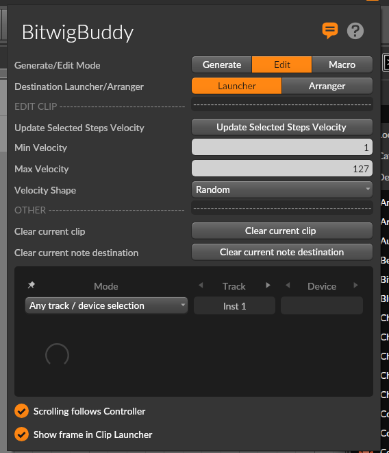
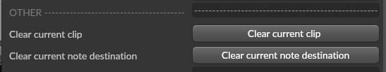

# Edit Mode

Edit Mode allows you to modify existing MIDI patterns by applying velocity transformations to selected notes.

## Accessing Edit Mode

To use Edit Mode:
1. Select "Edit" from the mode selector at the top of the BitwigBuddy panel
2. Open a MIDI clip in Bitwig Studio
3. Select some notes in the MIDI editor (if no notes are selected, no changes will be applied)

## Key Features

### Update Selected Steps Velocity

This is the main function in Edit Mode. It applies your chosen velocity settings to any selected notes in the current MIDI clip:

1. Select notes in the Bitwig MIDI editor
2. Configure velocity settings in BitwigBuddy
3. Click "Update Selected Steps Velocity" to apply changes

### Velocity Range

Set the bounds for velocity adjustments:

- **Min Velocity**: The minimum velocity value (1-127) 
- **Max Velocity**: The maximum velocity value (1-127)

### Velocity Shapes

Just like in Generate Mode, you can apply various velocity distributions to your selected notes:

- **Random**: Completely random velocities within the range
- **Flat (Value by Min Velocity)**: All notes get the Min Velocity value
- **Linear Inc/Dec**: Linear increase/decrease from Min to Max or Max to Min
- **Ease Curves**: Various easing functions for natural-feeling dynamics
- **Alternating**: Alternates between Min and Max velocities
- **Wave Forms**: Sine, Cosine, Triangle, Square, Saw patterns

This is particularly useful for:
- Humanizing mechanical patterns
- Creating dynamic crescendos and diminuendos
- Adding groove through velocity variations

### Clear Current Clip/Note Destination

The "Clear Current Clip" button removes all notes from the current clip, giving you a clean slate to work with.

## Application Examples

### Humanizing Patterns

1. Create or record a mechanical sounding pattern
2. Select all notes
3. Choose "Random" velocity shape with appropriate Min/Max range
4. Click "Update Selected Steps Velocity"

### Creating Crescendos

1. Select a series of notes
2. Choose "Linear Inc" velocity shape
3. Set Min Velocity to low value (e.g., 20)
4. Set Max Velocity to high value (e.g., 120)
5. Click "Update Selected Steps Velocity"

### Adding Swing Feel

1. Select off-beat notes only
2. Choose "Flat" velocity shape
3. Set Min Velocity to a lower value than your on-beat notes
4. Click "Update Selected Steps Velocity"

### Creating Complex Rhythmic Feels

1. Select a group of notes
2. Apply a wave-form velocity shape like "Sine" or "Triangle"
3. Click "Update Selected Steps Velocity"
4. The varying velocities create a rhythmic pulse

## Tips & Ideas

- Quickly humanize existing MIDI patterns by selecting notes and applying Random velocity shape
- Create crescendos with Linear Inc velocity shape
- Create diminuendos with Linear Dec velocity shape
- Add swing feel by adjusting velocities of off-beat notes
- Use Edit Mode for detailed pattern refinement
- Apply different velocity shapes to different sections of your pattern
- Combine with Generate Mode: generate patterns then refine them in Edit Mode
