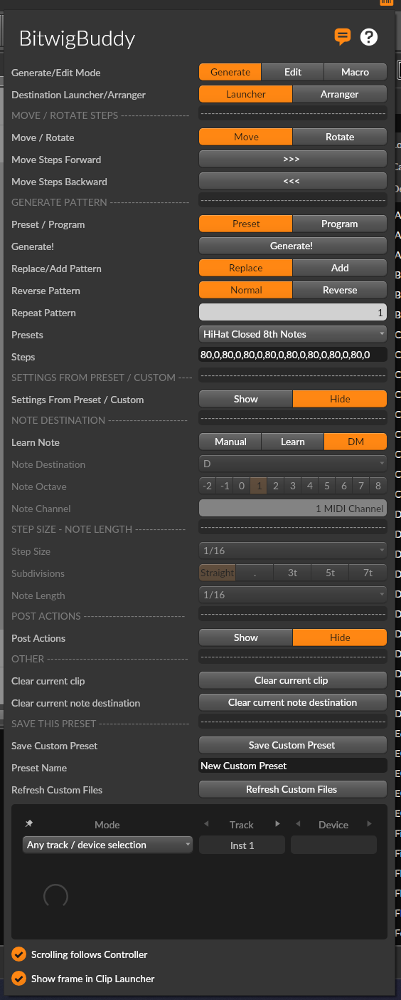
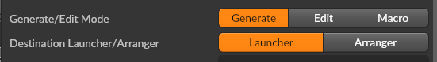
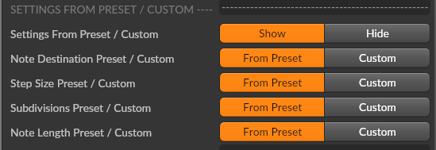
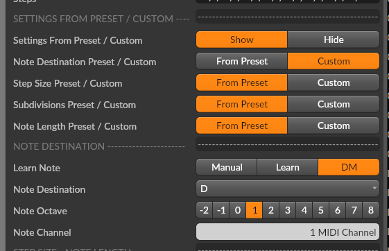
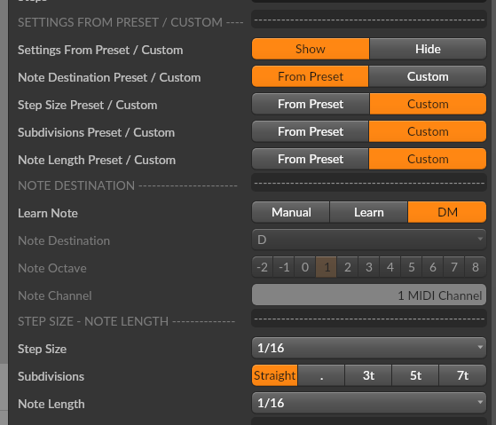
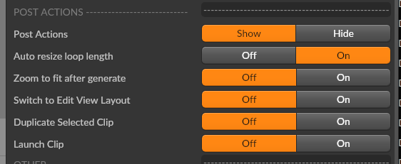

# Generate Mode

Generate Mode is the heart of BitwigBuddy, allowing you to quickly create drum patterns, rhythmic sequences, and musical phrases.

All selected settings in this panel are saved within the Bitwig Project.

## Mode Selection

First, ensure Generate Mode is selected from the mode selector at the top of the panel.

## Common Controls

These controls are available in both Preset and Program modes:

### Destination
- **Launcher**: Generated pattern is placed in the Clip Launcher view
- **Arranger**: Generated pattern is placed on the arranger timeline

### Replace/Add Pattern
- **Replace**: Overwrites existing notes completely
- **Add**: Adds generated pattern to existing notes (great for layering)

### Reverse Pattern
- **Normal**: Plays pattern as saved
- **Reverse**: Plays pattern in reverse order for creative variations

### Repeat Pattern X Times
- Repeat the pattern X times (1 to 8 times)
- Default: 1
- Example: If a pattern is 16 steps and you set Repeat Pattern to 2, the pattern will be 32 steps long
- Max 128 steps! If the pattern is longer than 128 steps, it will be truncated

## Preset Mode

In this mode you can generate steps in the selected clip using a preset pattern. Patterns are stored in the **Custom Presets** folder. You can create your own presets or use the built-in ones.

### Selecting Presets
1. Open the dropdown menu *Presets*
2. Select a preset from the list
3. The pattern's step data will be displayed in the UI, Note Destination, and other settings will be set according to the selected preset.

### Settings from Preset / Custom
By default, all settings are taken from the selected preset. You can override them by changing the settings in the UI. Check [Settings From Preset/Custom](#settings-from-preset-custom)

### Note Destination
- Set the MIDI note or drum pad for the pattern
- Use the Note selector to choose the note and octave
- Or use "Learn Note" to capture a played note:
  - Select "LN" to learn from any played note
  - Select "DM" to learn from clicked drum pads

### Step Size & Length
- **Step Size**: Sets the rhythmic grid for the pattern
- **Subdivisions**: Choose Straight, Triplets, Quintuplets, or Septuplets
- **Note Length**: Sets the duration of each generated note

## Program Mode

Program Mode gives you control over semi-random pattern generation.

### Controls
- **Steps**: Shows the selected step sequence
 - *[118, 0, 100, 0,]* → 4 steps. The second and the fourth steps are empty (0). The first and third steps are filled with notes with velocity 118 and 100.
- **Velocity Range**:
  - **Min Velocity**: Minimum note velocity (1-127)
  - **Max Velocity**: Maximum note velocity (1-127)
- **Velocity Shape**: Distribution method (Random, Linear, Arc, Sine, etc.)
- **Density**: Frequency of notes occurrence (0% to 100%)
- **Step Quantity**: Number of generated steps (1-128)
- **Skip Step Every X**: Skip steps systematically:
  - Example: Density 100%, Skip Step Every X at 1 → Skips all odd-numbered steps
  - Example: Density 100%, Skip Step Every X at 2 → Skips all even steps
  - Example: Density 100%, Skip Step Every X at 3 → Skips every third step

### Velocity Shapes
BitwigBuddy offers a wide variety of velocity shapes:

- **Random**: Completely random velocities
- **Flat**: All notes have the same velocity (Min Velocity value)
- **Linear Inc/Dec**: Linear increase/decrease from Min to Max or Max to Min
- **Ease Curves**: Various easing functions for natural-feeling dynamics
- **Alternating**: Alternates between Min and Max velocities
- **Wave Forms**: Sine, Cosine, Triangle, Square, Saw patterns

## Post Actions

After generating a pattern, you can trigger additional actions:

- **Duplicate Clip**: Creates a copy of the generated clip (Clip Launcher only)
- **Launch Clip**: Automatically plays the newly generated clip
- **Switch to Edit View Layout**: Changes Bitwig interface to Edit View after generation
- **Zoom To Fit**: Automatically zooms to show the entire pattern

## Custom Preset Creation

You can save your patterns as presets that will appear alongside the built-in ones:

1. Create a pattern you like
2. Click "Save Custom Pattern"
3. Enter a name for your preset
4. The preset will be saved as a .txt file in the Custom Presets folder

For more details on the preset system, see the [Presets System](/guide/bitwigbuddy/custom-presets) page.

## Workflow Presets

**Preparation:**
1. In Bitwig, select a clip from the *Clip Launcher* or *Arranger*
2. Open the BitwigBuddy panel
3. If your clip is in the arranger, select *Arranger* in the *Destination Launcher/Arranger* toggle

### Presets with default settings

1. Select a Preset from the *Presets* dropdown
2. Press Generate!

New step notes will be added to the selected clip.

### Presets with custom settings
1. Press *Show* 

## Workflow Program