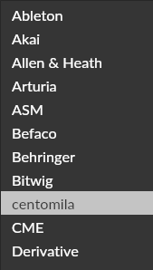
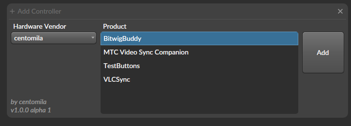

# Installation Guide

Getting BitwigBuddy up and running is quick and easy.

## System Requirements

- Bitwig Studio (latest version recommended)
- Windows, macOS, or Linux operating system

## ⚙️ Installation Steps

1. ⬇️ Download **_BitwigBuddy-1.0.0.zip_** from the [Release page](https://github.com/centomila/BeatBuddy-Bitwig-Extension-MIDI-Drum-Generator/releases)
   - Visit the release page on GitHub and locate the latest version of BitwigBuddy. Click the download link to save the zip file to your computer.

2. 📂 Extract the zip to the **_/Bitwig Studio/Extensions/_** folder. Be sure to extract the BitwigBuddy subfolder as well. It contains sample custom presets as txt files.
   - Use a file extraction tool to unzip the downloaded file. Navigate to the appropriate Extensions folder for your operating system and move the extracted files there.
     - **Windows:** `%USERPROFILE%\Documents\Bitwig Studio\Extensions`
       - If your Documents folder is in OneDrive, it might be in `%USERPROFILE%\OneDrive\Documents\Bitwig Studio\Extensions`
     - **macOS:** `~/Documents/Bitwig Studio/Extensions`
     - **Linux:** `~/Bitwig Studio/Extensions`

3. 🟧 In Bitwig, go to **Settings > Controller > Add Extension > Centomila > BitwigBuddy**
   - Open Bitwig Studio and navigate to the Settings menu. Under the Controller section, click "Add Extension" and select "Centomila" followed by "BitwigBuddy" from the list.

   1. *Navigate to the Controller settings in Bitwig Studio.*
   2. *Click on "Add Controller" to open the list of available extensions.*
      

   3. *Select "Centomila" from the list.*
   

   4. *Select "BitwigBuddy" from the list to add the extension.*
   

4. 🎉 BitwigBuddy should now appear in the Bitwig Studio Controller section

## Verifying Installation

After installation:

1. A BitwigBuddy panel should be available in Bitwig Studio
   - Check for the BitwigBuddy panel in the main interface of Bitwig Studio.
2. You'll see the Generate/Edit/Macro mode selector
   - Ensure that the mode selector is visible and functional.
3. The preset browser should display all available patterns
   - Open the preset browser to confirm that all patterns are loaded correctly.

If you don't see the panel, try these troubleshooting steps:

- Make sure you've completely extracted the zip file
- Check that the files are in the correct Extensions directory
- Restart Bitwig Studio
- Check the controller setup in Bitwig's settings

## Folder Structure

BitwigBuddy uses several folders for different purposes:

- **Custom Presets**: Store your own pattern presets as .txt files
- **Macros**: Contains macro script files
- **Presets**: Built-in pattern presets

All these folders are located within the BitwigBuddy folder in your Extensions directory.
